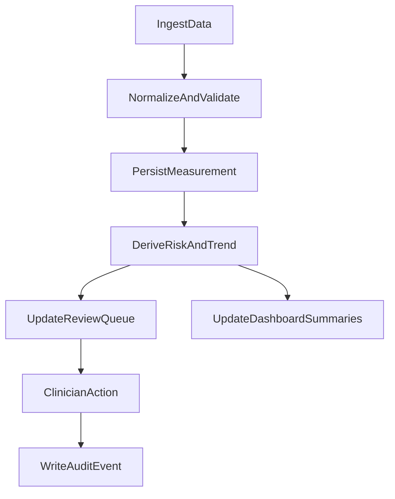

# Technical Architecture and Patterns

## Frontend

- Consolidate repeated chart/export logic from templates into reusable modules.
- Define shared interaction utilities:
  - async feedback helper
  - chart options factory
  - label and copy normalization helper
- Reduce CSS drift by consolidating repeated selectors and centralizing design tokens.

## Backend

- Split large view module into bounded contexts:
  - diagnostics
  - imports
  - medications
  - account/security
  - reporting/alerts
- Establish service boundaries:
  - risk computation service
  - trend assessment service
  - alert orchestration service
  - export/report service

## Data Flow

## Performance and Scale

- Cache expensive summary queries.
- Use server-side pagination and filtering for large lists.
- Move heavy recomputation to background jobs.
- Instrument request latency and chart render timing.
